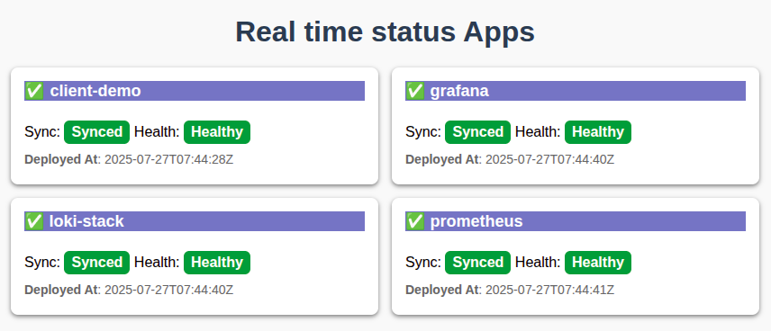
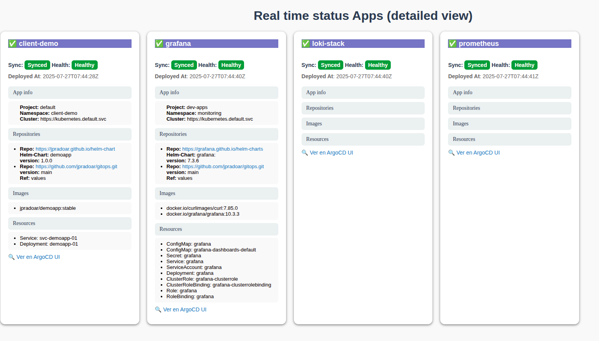

# ArgoInsights – Real-time Status API for ArgoCD Apps

ArgoInsights is an open source API that exposes <b>real-time deployment status</b> from [ArgoCD](https://argo-cd.readthedocs.io/). 
It was born from a real-world need: enabling <b>product and marketing teams</b> to instantly know which services/products  were seled and deployed, while also giving **developers** a simple way to access detailed deployment information.

Instead of asking Developers or DevOps, roduct and marketing teams can query this API and immediately see what’s running.  

 
 

## 🚀 Why ArgoInsights?

* **For business teams** → Know in real time which products are sold and deployed.
* **For developers** → Quickly access detailed deployment info (images, Helm charts, resources, etc).
* **For everyone** → A single API that bridges the gap between business and engineering.

No anyone need manage access, share passwords or get access to argocd with complrex views. You have simple and practic information

 
 

## ✨ Features

* ✅ Real-time sync with ArgoCD API
* ✅ Simple view for non-technical users (status, health, deployment date)
* ✅ Detailed view for developers (repositories, Helm charts, images, resources)
* ✅ Works out-of-the-box with any ArgoCD instance
* ✅ Built to solve a real-world business + tech need

---

## 📸 Screenshots

### Simple View (for business & product teams)

### Detailed View (for developers)

---

## 📦 Installation
    kubectl apply -f https://raw.githubusercontent.com/jpradoar/argocd-badges-api/refs/heads/develop/manifest/main.yaml

---

## 🔍 Usage

### Get real-time status of all apps

---

## 🏗 Real-world use case

ArgoInsights was originally built to help **product and marketing teams** instantly know:

* Which products were sold and already provisioned.
* When each product was deployed.

Instead of creating a new internal system, we leveraged ArgoCD’s source of truth and built an API around it. Over time, **developers also adopted it** to check images, deployments, and resources without going into the full ArgoCD dashboard.

---

## 🗺 Roadmap

* [ ] Export reports (CSV/Excel)

---

## 🤝 Contributing

---

## 📄 License

---

### ⭐ If this project helps you, please give it a star on GitHub!
